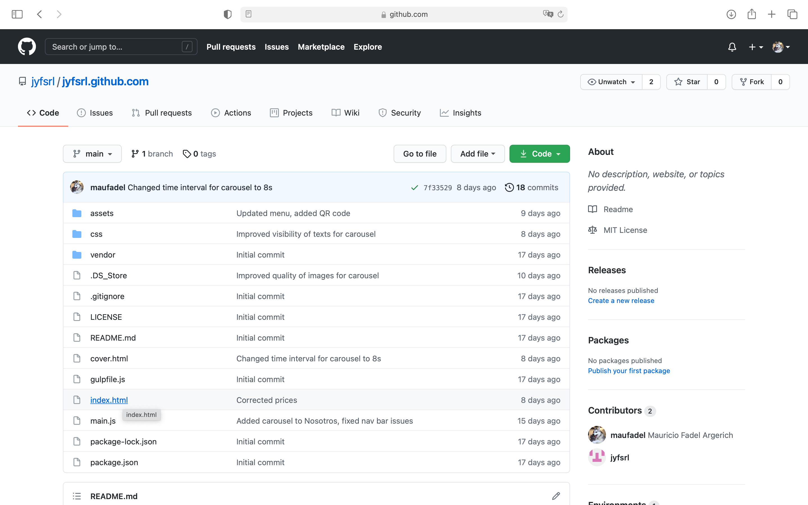
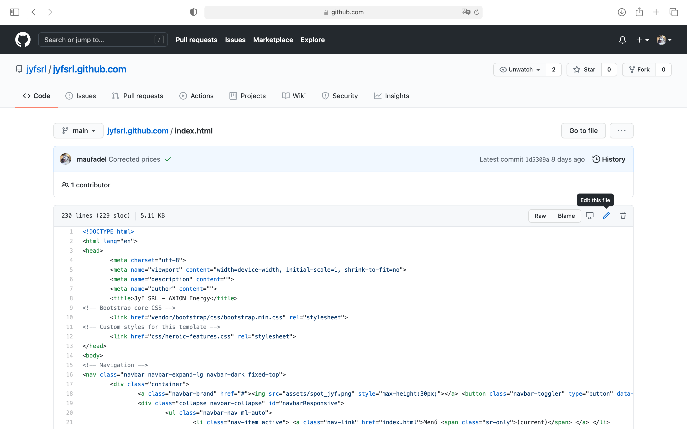
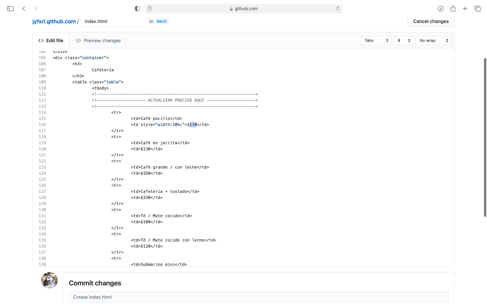
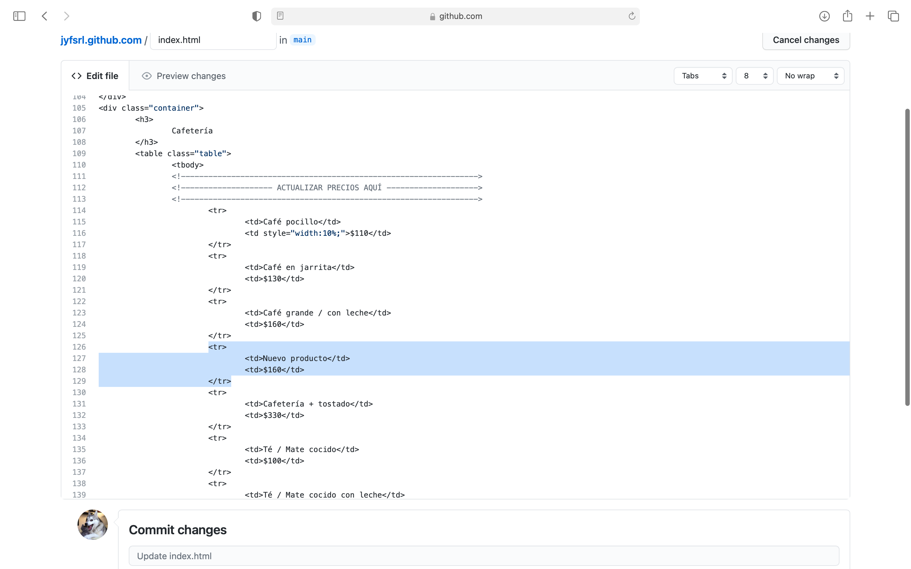
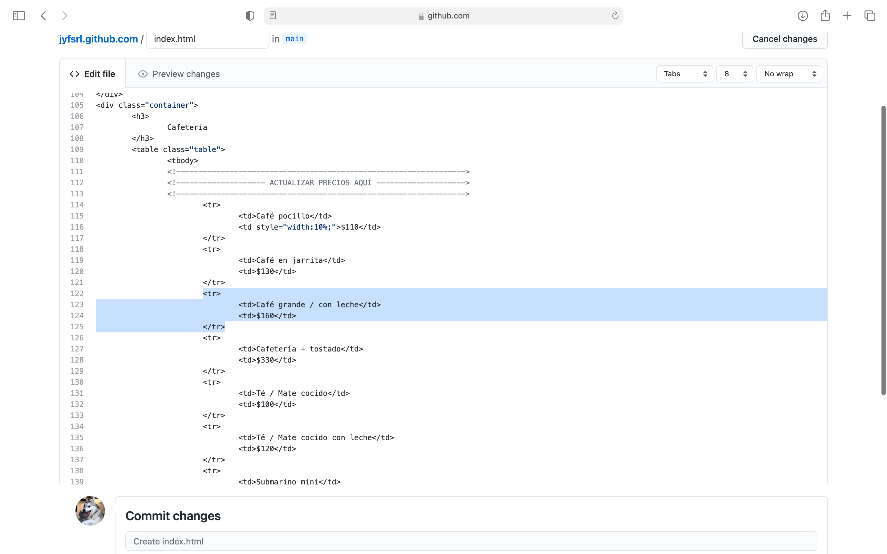
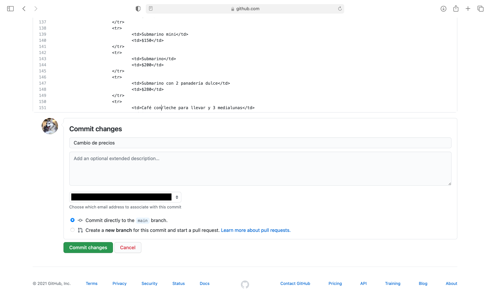

# Instrucciones para actualizar precios

1. Iniciar sesión en Github.com

2. Entrar al link https://github.com/jyfsrl/jyfsrl.github.com

3. Hacer click en index.html

4. Hacer click en el ícono de editar (un lápiz como se ve en la imagen)

5. Ir hasta donde dice "ACTUALIZAR PRECIOS AQUÍ" (alternativa: ctrl+F para buscar el 
texto).

6. Para cambiar precios de ítems ya existentes, basta con cambiar el precio que se ve 
debajo de cada ítem como se muestra en la imagen.

7. Para añadir un nuevo ítem, copiar y pegar el siguiente código después de cualquier
\\</tr>, reemplazando con el nombre del producto y el precio con el símbolo $.

<tr>
	<td>Nombre del nuevo ítem</td>
	<td>$XXX</td>
</tr>

8. Para eliminar un ítem, borrar las 4 líneas de código desde \<tr> hasta \<\tr>.

9. Guardar cambios haciendo un commit. Escribir un título y comentario para indicar los 
cambios realizados y hacer click en el botón verde "Confirmar cambios".
